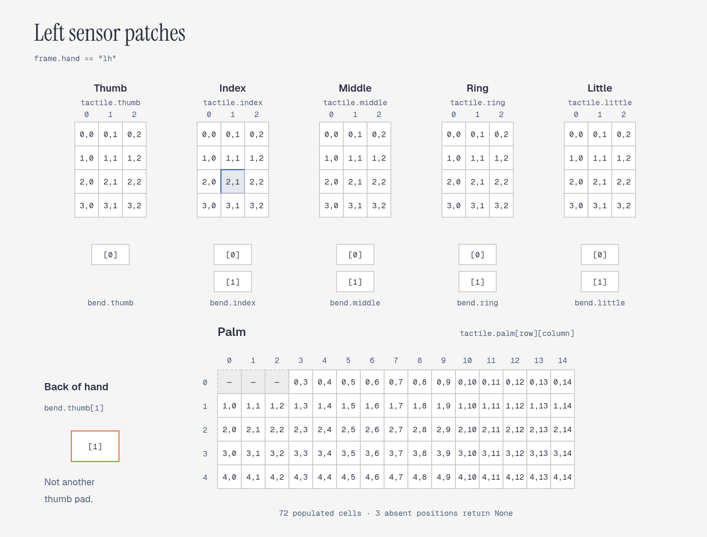
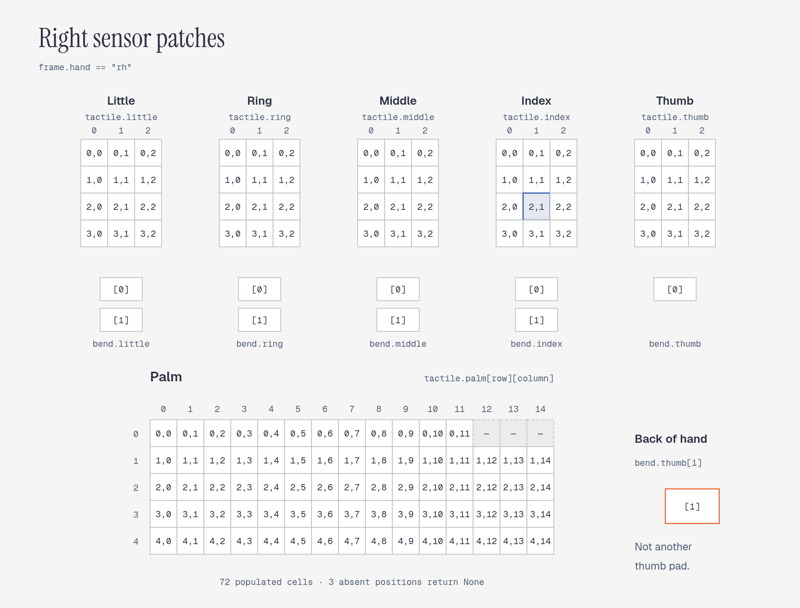

# TouchTronix FusionX Glove SDK

Python API, examples, and physical sensor diagrams for **V2 conductive-fabric gloves**.

## Daily Use and Maintenance

- **Contact technical support if you encounter product issues.** Do not disassemble the glove without authorization.
  The manufacturer is not responsible for damage caused by unauthorized disassembly.
- **Avoid direct contact between sharp objects and the sensors.**
- **Do not pull connection cables forcefully.** This helps preserve the product's service life.
- **Regularly inspect the glove's condition and operation.** If you find damage or abnormalities,
  stop using it immediately and contact qualified service personnel to arrange factory inspection and repair.
- **Clean the surface with a soft, dry cloth.** Avoid cleaners containing corrosive chemical solvents.
- **Avoid excessive pressure on the main control board** to prevent damage to internal components.
- **Wearing medical nitrile gloves underneath is recommended** for additional protection and to help extend the sensing
  gloves' service life.

## SDK Overview

- SDK package version: **0.2.0**. The branch name `v2-conductive-fabric` identifies the glove configuration, not the
  Python package version.
- TouchTronix supplies compiled SDK wheels directly to customers. This repository provides documentation, examples,
  and sensor diagrams.
- Older SDK/app instructions and camera tools remain on
  [`v1-conductive-fabric`](https://github.com/TouchTronix-Robotics/FusionX-DataCollection/tree/v1-conductive-fabric).

## Install

Use the SDK wheel (`.whl` file) supplied by TouchTronix for your Python version, operating system, and CPU architecture.
Contact TouchTronix if you need an SDK package or a different build. The current build targets are **Python 3.12,
Linux x86_64, and Windows x86_64**. Hardware/driver compatibility must also be verified on your deployment machine.

**Recommended Linux platform:** Ubuntu 22.04 LTS on a 64-bit Intel/AMD machine, with Python 3.12.

Linux, from the directory containing your wheel:

```bash
python3.12 -m venv .venv
source .venv/bin/activate
python -m pip install ./touchtronix_glove-0.2.0-cp312-cp312-linux_x86_64.whl
```

Windows PowerShell:

```powershell
py -3.12 -m venv .venv
.\.venv\Scripts\Activate.ps1
python -m pip install .\touchtronix_glove-0.2.0-cp312-cp312-win_amd64.whl
```

## Quick start

```python
from touchtronix_glove import GloveReader

# One port string also works. On Windows use, for example, ["COM3", "COM4"].
with GloveReader(["/dev/ttyACM0", "/dev/ttyACM1"]) as gloves:
    frame = next(gloves.stream())
    print(frame.hand)                     # "lh" or "rh", reported by the device
    print(frame.tactile.index[2][1])      # blue cell in the diagrams below
    print(frame.tactile.palm[1][4])       # palm: row 1, column 4
    print(frame.bend.thumb)               # (thumb pad, dorsal/back-of-hand sensor)
    print(frame.imu.quaternion)           # (w, x, y, z)
```

The context manager opens and closes the ports, including when an exception or interrupt occurs. Hand identity comes
from the device, never from port argument order. The connection speed is **6,000,000 baud**.

## Glove configuration: locate an SDK value

### Left glove — `frame.hand == "lh"`



### Right glove — `frame.hand == "rh"`



## GloveReader

```python
from touchtronix_glove import GloveReader

reader = GloveReader("/dev/ttyACM0", baudrate=6_000_000)
```

| Argument | Type / default | Meaning |
|---|---|---|
| `port` | `str` or a sequence of one/two strings | Explicit serial port names; empty names are rejected. |
| `baudrate` | `int`, default `6_000_000` | Serial connection speed; setup is handled by the serial backend. |

These are the only configuration options. The SDK uses this glove's fixed format, automatic handedness, and a fixed
0.1-second read wait budget (not a sensor sampling interval).

Linux port examples: `/dev/ttyACM0`, `/dev/ttyACM1`; Windows: `COM3`, `COM4`. Ports are not auto-scanned. With two ports,
both streams get opportunities to deliver frames; a silent port does not stall its sibling. Streams are neither
synchronized nor globally sorted by timestamp.

| Operation | Result / behavior |
|---|---|
| `connect()` | Opens the ports; setup failure closes ports already opened. Connecting twice raises `RuntimeError`. |
| `disconnect()` | Closes ports and clears pending partial input. Repeated calls are safe. |
| `read_frame()` | Returns a complete `GloveFrame` or `None` if none completes within the wait budget. May wait; it is not a zero-wait polling API. Reading before connecting raises `RuntimeError`. |
| `stream()` | Iterator yielding every complete frame without resampling or deduplication. Skips `None` results, not sensor samples. |
| `with GloveReader(...) as reader:` | Connects on entry and disconnects on exit. |

The reader is synchronous and single-consumer: do not read the same instance concurrently from multiple threads.
It starts no background worker. The example's acquisition worker and viewer are separate from the SDK reader.

## GloveFrame

An immutable snapshot returned by `read_frame()` or `stream()`. Sensor arrays are Python tuples.
Named tactile/bend fields and all listed IMU channels are populated for this V2 glove configuration, the only
configuration supported by this SDK.

```python
from touchtronix_glove import GloveFrame, TactileData, BendData, IMUData
```

| Field / property | Type | Meaning |
|---|---|---|
| `hand` | `str` | `"lh"` or `"rh"`; use to route values to the physical hand. |
| `tactile` | `TactileData` | Named fingertip and palm measurements. |
| `bend` | `BendData` | Named pad/dorsal channels. |
| `imu` | `IMUData` | Device orientation and motion measurements. |
| `host_timestamp_ns` | `int` | Unix host read-completion time in nanoseconds, not the sensor acquisition time. |
| `timestamp` | `float` | The same host time in seconds: `host_timestamp_ns / 1_000_000_000`. |

### TactileData

All populated readings are **raw integers from 0 to 255**, not calibrated pressure or force. The SDK does not apply
baseline subtraction, force conversion, or normalization.

| Field | Shape / element type | Physical meaning |
|---|---|---|
| `thumb`, `index`, `middle`, `ring`, `little` | 4×3 nested tuples of `int` | Corresponding finger's tactile patch. |
| `palm` | 5×15 nested tuples of `int \| None` | Palm patch: 72 populated cells, three absent positions. |

Access matrices as `frame.tactile.<field>[row][column]`. Absent palm cells:

- LH: `palm[0][0]`, `palm[0][1]`, `palm[0][2]` are `None`.
- RH: `palm[0][12]`, `palm[0][13]`, `palm[0][14]` are `None`.

Only the three absent palm cells are `None`; the named sensor patches are populated.

### BendData

Every field is an immutable **two-value tuple**, with raw 0–255 readings:

| Field | `[0]` | `[1]` |
|---|---|---|
| `thumb` | Thumb finger pad | Dorsal/back-of-hand sensor |
| `index`, `middle`, `ring`, `little` | Upper finger pad, nearer the fingertip | Lower finger pad, nearer the palm |

```python
thumb_pad, dorsal = frame.bend.thumb
upper_pad, lower_pad = frame.bend.index
```

`bend.thumb[1]` is **not a second physical thumb pad**. The sensor is on the back of the hand, where motion associated
with the thumb's second degree of freedom is better measured. The grouping keeps all five tuple shapes consistent.
These readings are not calibrated bend angles.

### IMUData

| Field | Python tuple order | Meaning / units |
|---|---|---|
| `quaternion` | `(w, x, y, z)` | Device orientation quaternion, retained without normalization. |
| `gyro` | `(x, y, z)` | Angular velocity; firmware convention rad/s. |
| `accel` | `(x, y, z)` | Acceleration including gravity; firmware convention m/s². |
| `magnetometer` | `(x, y, z)` | Magnetic-field readings; vendor units unspecified. |

## Streaming example and optional viewer

With a matching wheel installed, run from this repository's root:

```bash
python examples/stream_glove.py /dev/ttyACM0
python examples/stream_glove.py /dev/ttyACM0 /dev/ttyACM1 --seconds 30
```

On Windows, use `python examples\stream_glove.py COM3 COM4 --seconds 30`. The terminal reports counts, mean delivery
rates, and frame age, not complete sensor arrays. Press Ctrl+C to stop. There is no `--hand` CLI argument.

Viewer dependencies are already included in the normal SDK installation. To view live data:

```bash
python examples/stream_glove.py /dev/ttyACM0 /dev/ttyACM1 --viewer
```

Keep `glove_viewer.py` beside `stream_glove.py`. Both hands have
fingertip/palm heatmaps, bend bars, and compact IMU plots. Palm axes use the graph's zero-based indices. Blue bend bars
show `[0]`, orange bars `[1]`; the orange thumb bar is dorsal. Absent palm cells are blank; stale displays dim.

Acquisition runs on a separate worker. Preview history is bounded, and display refresh does not set acquisition cadence.
Actual delivery still depends on the hardware, host load, and buffering. Read errors propagate instead of being silently
ignored. Closing the viewer or pressing Ctrl+C stops acquisition and closes resources.

The example only streams and optionally displays data; it does not save files. Use `GloveReader` in your application to
process or store the decoded fields with `frame.hand` and `frame.host_timestamp_ns`. Transport byte buffers are not
exposed by the API.

## Serial access and troubleshooting

- On Linux, inspect `ls -l /dev/ttyACM* /dev/ttyUSB*` and `groups`. If permission is denied, join the device's access group
  (usually `dialout` on Ubuntu, or `uucp` elsewhere), then log out and back in. For an Ubuntu device owned by `dialout`:
  `sudo usermod -aG dialout "$USER"`. Avoid `sudo python`, which can use a different environment.
- On Windows, check Device Manager for COM ports and install the hardware vendor's driver if necessary.
- Close any other application using the same port. Confirm the connection supports the configured speed.
