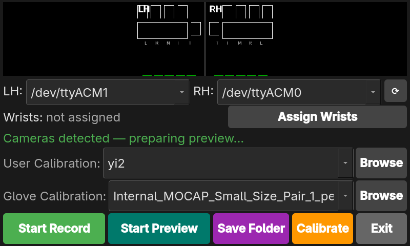
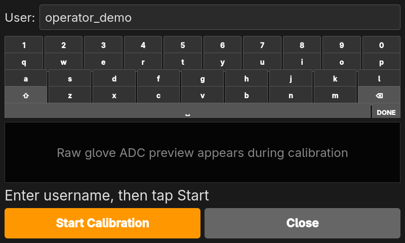
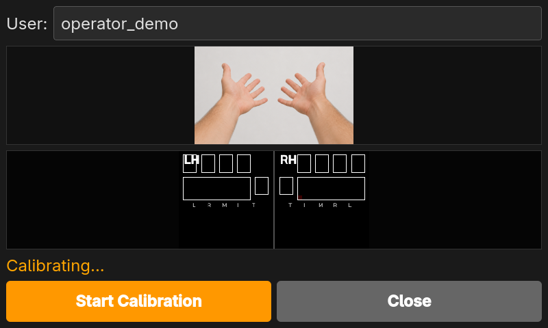
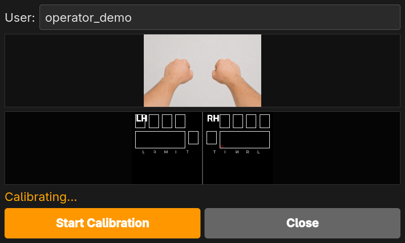
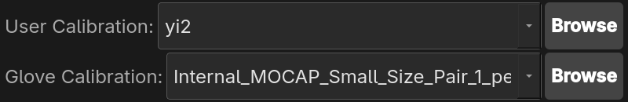
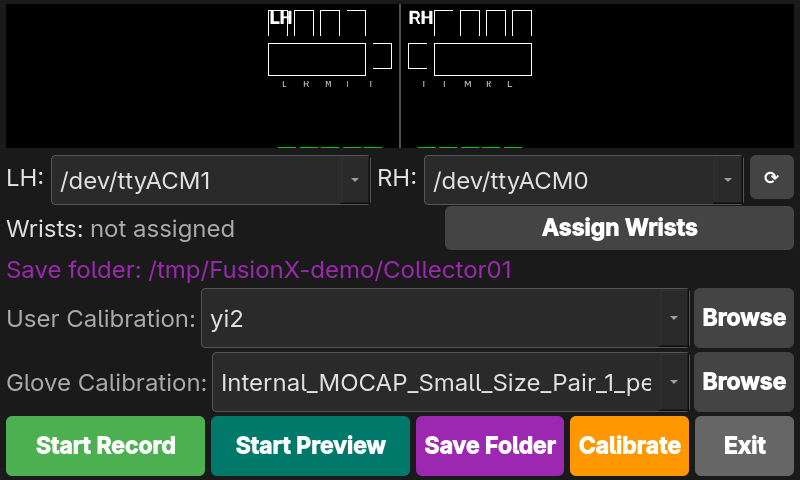
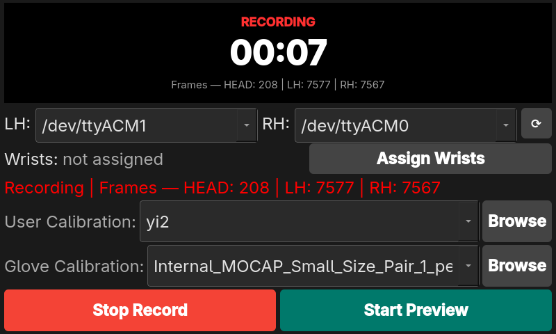

# TouchTronix FusionX Data Collection & Glove SDK

GUI recording instructions, Python API, examples, and physical sensor diagrams for **V2 conductive-fabric gloves**.

- [GUI data collection guide](#gui-data-collection-guide) — connect, calibrate, record, and inspect MCAP files.
- [SDK quick start](#sdk-quick-start) — stream glove data from Python.
- [Glove sensor diagrams](#glove-configuration-locate-an-sdk-value) — locate values on each hand.

## Daily Use and Maintenance

- **Contact technical support if you encounter product issues.** Do not disassemble the glove without authorization.
  The manufacturer is not responsible for damage caused by unauthorized disassembly.
- **Avoid direct contact between sharp objects and the sensors.**
- **Do not pull connection cables forcefully.** This helps preserve the product's service life.
- **Regularly inspect the glove's condition and operation.** If you find damage or abnormalities,
  stop using it immediately and contact qualified service personnel to arrange factory inspection and repair.
- **Clean the surface with a soft, dry cloth.** Avoid cleaners containing corrosive chemical solvents.
- **Avoid excessive pressure on the main control board** to prevent damage to internal components.
- **Wearing medical nitrile gloves underneath is recommended** for additional protection and to help extend the sensing
  gloves' service life.

## GUI data collection guide

Record synchronized stereo video, glove tactile/bend data, and IMU data into `.mcap` files.
The five steps below use the **FusionX GUI for V2 conductive-fabric gloves**.

### Before you start

- Use the current **[FusionX GUI v2.2.0](https://github.com/TouchTronix-Robotics/FusionX-DataCollection/releases/tag/v2.2.0)**, with your license key and the force/pressure
  calibration for your glove pair. This public branch contains documentation and SDK wheels; installing an SDK wheel
  alone does not install the recording GUI. Older application releases may use different cameras or glove hardware.
- On **Windows**, extract the complete application archive, then launch its GUI `.exe`. On **Linux**, launch the supplied
  GUI AppImage; if necessary, mark it executable in the file manager's properties first. Keep any bundled support files
  beside the application. Enter the license key if prompted.
- Connect both gloves and the head stereo camera. Close other programs that are using these devices.
- Create a destination folder on a drive with enough free space for video recordings.

The screenshots were captured from the current Linux GUI with **camera preview disabled**. Windows uses the same
controls; serial-port names and the native folder/file pickers differ by operating system. The port assignments and
calibration filenames shown are examples for the pictured setup, not defaults for every machine.

### 1. Select the left and right glove ports

In **LH**, choose the port for the left glove. In **RH**, choose the port for the right glove.
Use the circular-arrow button to refresh the list after connecting a glove.

| Control | Example in these screenshots | Windows example |
|---|---|---|
| **LH** — left glove | `/dev/ttyACM1` | `COM3` |
| **RH** — right glove | `/dev/ttyACM0` | `COM4` |

Use the ports assigned to **your** gloves; do not choose the same port for both hands. Touch each glove and check that
its **LH/RH raw heatmap** responds on the correct side. These glove heatmaps are available while idle even when camera
preview is off.



The **head stereo camera is detected automatically**; there is no left/right camera-port selection. Allow camera
initialization to finish before recording. A connected head camera is required. If you also have optional wrist cameras,
use **Assign Wrists** to identify them from their thumbnails; otherwise leave the wrists unassigned.

### 2. Run the user calibration

Click the orange **Calibrate** button. On the calibration screen:

1. Enter a username using the on-screen keyboard or your physical keyboard. Use a new name to keep an existing calibration.
2. Click **Start Calibration**.
3. Follow the on-screen hand-pose images and audio/countdown prompts. First **straighten all fingers and keep the palms
   relaxed**, without pressing the tactile pads. Hold that pose through the collection cue.
4. When prompted, **close every finger into a fist, including the thumb**, and hold still through the collection cue.
5. Wait for **Calibration complete**, then click **Close** to return to the main screen.



The app shows these built-in pose guides during calibration:

| Open hand | Closed fist |
|---|---|
|  |  |

The app saves the user calibration as a JSON file in its `calibrations` folder.
We recommend recalibrating whenever you put the gloves on again.

### 3. Select the user and force calibrations

Back on the main screen, open each dropdown and select the files for this session:

| Dropdown label | What to select |
|---|---|
| **User Calibration** | The JSON calibration for the current wearer, created in step 2. |
| **Glove Calibration** | The supplied **force or pressure calibration for this physical glove pair**. This is the force-calibration selector. |



Use **Browse** beside either dropdown if the file is stored elsewhere. Check both selections even if the app has
preselected files.
Use your own wearer's file and the matching glove-pair calibration.

**Both calibrations must be selected to record calibrated force values.** Raw tactile and bend data are still recorded
without force conversion.

### 4. Choose where recordings are saved

Click **Save Folder**, navigate to the destination folder, and confirm it in the system's folder picker.
The status line shows the selected path; hovering over **Save Folder** also shows the full path.



Choose the **final session folder**, for example:

```text
FusionX_Data/
  20261007/
    Tabletop_Task/
      Collector01_Pair01/   ← select this folder
```

A location such as `D:\FusionX_Data\...` on Windows or a folder under your home directory on Linux is suitable.
The `/tmp/` location shown in the screenshot was used only for this demonstration; choose persistent storage for your data.
**Save Folder chooses the destination; it does not start a recording.**

### 5. Start and stop data collection

1. Check the two glove ports, both calibration selections, and the save folder.
2. Click **Start Record**. Wait for the status to change from camera startup to **Recording**, and confirm that the head
   and both glove counters are increasing.
3. Perform the data-collection task.
4. Click **Stop Record**. Wait until the app reports **Saved** before opening the output files or disconnecting devices.
   If it reports an error or missing sensor data, inspect the recording before treating the session as complete.



**Camera preview is optional.** If live view is running, click **Stop Preview** to reduce display/decoding work.
**Start Preview** turns it back on. Preview can be toggled before or during a recording and does not stop recording
or disable camera capture. When preview is off during recording, the app shows the recording timer and counters
instead of video.

**Space** also starts/stops recording from the main window; it is ignored while editing text or using child dialogs.

#### Find and inspect the `.mcap` files

Open the folder selected in step 4. Recordings are saved directly into it:

```text
Collector01_Pair01/
  recording_000.mcap
  recording_001.mcap
  ...
```

Long recordings are split automatically into segments, roughly every five minutes at 30 head-camera FPS.
Starting another recording in the same folder uses the next unused index, preserving earlier files.
Wait for **Saved** so the files have finished closing.

Use **Foxglove Desktop** for playback:

1. Install [Foxglove Desktop](https://foxglove.dev/download). Opening local files and installing local extensions require
   a [Foxglove developer seat](https://docs.foxglove.dev/docs/security/seat-types).
2. Download the [FusionX Tactile 0.3.0 extension](https://raw.githubusercontent.com/TouchTronix-Robotics/FusionX-DataCollection/refs/heads/v2-conductive-fabric/touchtronixrobotics.fusionx-tactile-panel-0.3.0.foxe) and the
   [FusionX layout](https://raw.githubusercontent.com/TouchTronix-Robotics/FusionX-DataCollection/refs/heads/v2-conductive-fabric/fusionx_foxglove_layout.json) from the public repository.
3. Open or drag the `.foxe` file into Foxglove, then reload the app. Install the extension **before** importing the layout.
4. Choose **Layouts → Import from file…** and select `fusionx_foxglove_layout.json`.
5. Choose **Open local file(s)** (or press **Ctrl+O**) and select a finished `recording_###.mcap`.
6. Press play and scrub the timeline. Inspect the **FusionX Tactile** panel and the IMU plots. Use the image panel for
   stereo-video playback when needed. The saved stereo image contains the left and right views side by side.

Use Foxglove's [**Data Source Info** panel](https://docs.foxglove.dev/docs/visualization/panels/data-source-info) to check message counts and duration, and **Raw Messages** to inspect samples
on these topics:

| Topic | What to check |
|---|---|
| `/camera/head/stereo/h264` | Head stereo video with a nonzero message count. |
| `/glove/lh/tactile`, `/glove/rh/tactile` | Both gloves' tactile and bend readings. |
| `/glove/lh/imu`, `/glove/rh/imu` | Both gloves' orientation/motion readings. |
| `/camera/head/imu` | Head-camera IMU readings. |
| `/calibration/glove/user/json` | The user calibration stored in the recording. |

---

## SDK Overview

- SDK package version: **0.2.0**. The branch name `v2-conductive-fabric` identifies the glove configuration, not the
  Python package version.
- TouchTronix supplies compiled SDK wheels directly to customers. This repository provides documentation, examples,
  and sensor diagrams.
- Older SDK/app instructions and camera tools remain on
  [`v1-conductive-fabric`](https://github.com/TouchTronix-Robotics/FusionX-DataCollection/tree/v1-conductive-fabric).

## SDK quick start

Use the SDK wheel (`.whl` file) supplied by TouchTronix for your Python version, operating system, and CPU architecture.
Contact TouchTronix if you need an SDK package or a different build. The current build targets are **Python 3.12,
Linux x86_64, and Windows x86_64**. Hardware/driver compatibility must also be verified on your deployment machine.

**Recommended Linux platform:** Ubuntu 22.04 LTS on a 64-bit Intel/AMD machine, with Python 3.12.

Linux, from the directory containing your wheel:

```bash
python3.12 -m venv .venv
source .venv/bin/activate
python -m pip install ./touchtronix_glove-0.2.0-cp312-cp312-linux_x86_64.whl
git clone --branch v2-conductive-fabric https://github.com/TouchTronix-Robotics/FusionX-DataCollection.git
cd FusionX-DataCollection
python examples/stream_glove.py /dev/ttyACM0 /dev/ttyACM1 --viewer
```

Windows PowerShell, from the directory containing your wheel:

```powershell
py -3.12 -m venv .venv
.\.venv\Scripts\Activate.ps1
python -m pip install .\touchtronix_glove-0.2.0-cp312-cp312-win_amd64.whl
git clone --branch v2-conductive-fabric https://github.com/TouchTronix-Robotics/FusionX-DataCollection.git
cd FusionX-DataCollection
python examples/stream_glove.py COM3 COM4 --viewer
```

Replace the port names with your glove ports. Close the viewer or press Ctrl+C to stop.

## Python API example

```python
from touchtronix_glove import GloveReader

# One port string also works. On Windows use, for example, ["COM3", "COM4"].
with GloveReader(["/dev/ttyACM0", "/dev/ttyACM1"]) as gloves:
    frame = next(gloves.stream())
    print(frame.hand)                     # "lh" or "rh", reported by the device
    print(frame.tactile.index[2][1])      # blue cell in the diagrams below
    print(frame.tactile.palm[1][4])       # palm: row 1, column 4
    print(frame.bend.thumb)               # (thumb pad, dorsal/back-of-hand sensor)
    print(frame.imu.quaternion)           # (w, x, y, z)
```

The context manager opens and closes the ports, including when an exception or interrupt occurs. Hand identity comes
from the device, never from port argument order. The connection speed is **6,000,000 baud**.

## Glove configuration: locate an SDK value

### Left glove — `frame.hand == "lh"`


### Right glove — `frame.hand == "rh"`


## GloveReader

```python
from touchtronix_glove import GloveReader

reader = GloveReader("/dev/ttyACM0", baudrate=6_000_000)
```

| Argument | Type / default | Meaning |
|---|---|---|
| `port` | `str` or a sequence of one/two strings | Explicit serial port names; empty names are rejected. |
| `baudrate` | `int`, default `6_000_000` | Serial connection speed; setup is handled by the serial backend. |

These are the only configuration options. The SDK uses this glove's fixed format, automatic handedness, and a fixed
0.1-second read wait budget (not a sensor sampling interval).

Linux port examples: `/dev/ttyACM0`, `/dev/ttyACM1`; Windows: `COM3`, `COM4`. Ports are not auto-scanned. With two ports,
both streams get opportunities to deliver frames; a silent port does not stall its sibling. Streams are neither
synchronized nor globally sorted by timestamp.

| Operation | Result / behavior |
|---|---|
| `connect()` | Opens the ports; setup failure closes ports already opened. Connecting twice raises `RuntimeError`. |
| `disconnect()` | Closes ports and clears pending partial input. Repeated calls are safe. |
| `read_frame()` | Returns a complete `GloveFrame` or `None` if none completes within the wait budget. May wait; it is not a zero-wait polling API. Reading before connecting raises `RuntimeError`. |
| `stream()` | Iterator yielding every complete frame without resampling or deduplication. Skips `None` results, not sensor samples. |
| `with GloveReader(...) as reader:` | Connects on entry and disconnects on exit. |

The reader is synchronous and single-consumer: do not read the same instance concurrently from multiple threads.
It starts no background worker. The example's acquisition worker and viewer are separate from the SDK reader.

## GloveFrame

An immutable snapshot returned by `read_frame()` or `stream()`. Sensor arrays are Python tuples.
Named tactile/bend fields and all listed IMU channels are populated for this V2 glove configuration, the only
configuration supported by this SDK.

```python
from touchtronix_glove import GloveFrame, TactileData, BendData, IMUData
```

| Field / property | Type | Meaning |
|---|---|---|
| `hand` | `str` | `"lh"` or `"rh"`; use to route values to the physical hand. |
| `tactile` | `TactileData` | Named fingertip and palm measurements. |
| `bend` | `BendData` | Named pad/dorsal channels. |
| `imu` | `IMUData` | Device orientation and motion measurements. |
| `host_timestamp_ns` | `int` | Unix host read-completion time in nanoseconds, not the sensor acquisition time. |
| `timestamp` | `float` | The same host time in seconds: `host_timestamp_ns / 1_000_000_000`. |

### TactileData

All populated readings are **raw integers from 0 to 255**, not calibrated pressure or force. The SDK does not apply
baseline subtraction, force conversion, or normalization.

| Field | Shape / element type | Physical meaning |
|---|---|---|
| `thumb`, `index`, `middle`, `ring`, `little` | 4×3 nested tuples of `int` | Corresponding finger's tactile patch. |
| `palm` | 5×15 nested tuples of `int \| None` | Palm patch: 72 populated cells, three absent positions. |

Access matrices as `frame.tactile.<field>[row][column]`. Absent palm cells:

- LH: `palm[0][0]`, `palm[0][1]`, `palm[0][2]` are `None`.
- RH: `palm[0][12]`, `palm[0][13]`, `palm[0][14]` are `None`.

Only the three absent palm cells are `None`; the named sensor patches are populated.

### BendData

Every field is an immutable **two-value tuple**, with raw 0–255 readings:

| Field | `[0]` | `[1]` |
|---|---|---|
| `thumb` | Thumb finger pad | Dorsal/back-of-hand sensor |
| `index`, `middle`, `ring`, `little` | Upper finger pad, nearer the fingertip | Lower finger pad, nearer the palm |

```python
thumb_pad, dorsal = frame.bend.thumb
upper_pad, lower_pad = frame.bend.index
```

`bend.thumb[1]` is **not a second physical thumb pad**. The sensor is on the back of the hand, where motion associated
with the thumb's second degree of freedom is better measured. The grouping keeps all five tuple shapes consistent.
These readings are not calibrated bend angles.

### IMUData

| Field | Python tuple order | Meaning / units |
|---|---|---|
| `quaternion` | `(w, x, y, z)` | Device orientation quaternion, retained without normalization. |
| `gyro` | `(x, y, z)` | Angular velocity; firmware convention rad/s. |
| `accel` | `(x, y, z)` | Acceleration including gravity; firmware convention m/s². |
| `magnetometer` | `(x, y, z)` | Magnetic-field readings; vendor units unspecified. |

## Streaming example and optional viewer

With a matching wheel installed, run from this repository's root:

```bash
python examples/stream_glove.py /dev/ttyACM0
python examples/stream_glove.py /dev/ttyACM0 /dev/ttyACM1 --seconds 30
```

On Windows, use `python examples\stream_glove.py COM3 COM4 --seconds 30`. The terminal reports counts, mean delivery
rates, and frame age, not complete sensor arrays. Press Ctrl+C to stop. There is no `--hand` CLI argument.

Viewer dependencies are already included in the normal SDK installation. To view live data:

```bash
python examples/stream_glove.py /dev/ttyACM0 /dev/ttyACM1 --viewer
```

Keep `glove_viewer.py` beside `stream_glove.py`. Both hands have
fingertip/palm heatmaps, bend bars, and compact IMU plots. Palm axes use the graph's zero-based indices. Blue bend bars
show `[0]`, orange bars `[1]`; the orange thumb bar is dorsal. Absent palm cells are blank; stale displays dim.

Acquisition runs on a separate worker. Preview history is bounded, and display refresh does not set acquisition cadence.
Actual delivery still depends on the hardware, host load, and buffering. Read errors propagate instead of being silently
ignored. Closing the viewer or pressing Ctrl+C stops acquisition and closes resources.

The example only streams and optionally displays data; it does not save files. Use `GloveReader` in your application to
process or store the decoded fields with `frame.hand` and `frame.host_timestamp_ns`. Transport byte buffers are not
exposed by the API.

## Serial access and troubleshooting

- On Linux, inspect `ls -l /dev/ttyACM* /dev/ttyUSB*` and `groups`. If permission is denied, join the device's access group
  (usually `dialout` on Ubuntu, or `uucp` elsewhere), then log out and back in. For an Ubuntu device owned by `dialout`:
  `sudo usermod -aG dialout "$USER"`. Avoid `sudo python`, which can use a different environment.
- On Windows, check Device Manager for COM ports and install the hardware vendor's driver if necessary.
- Close any other application using the same port. Confirm the connection supports the configured speed.
